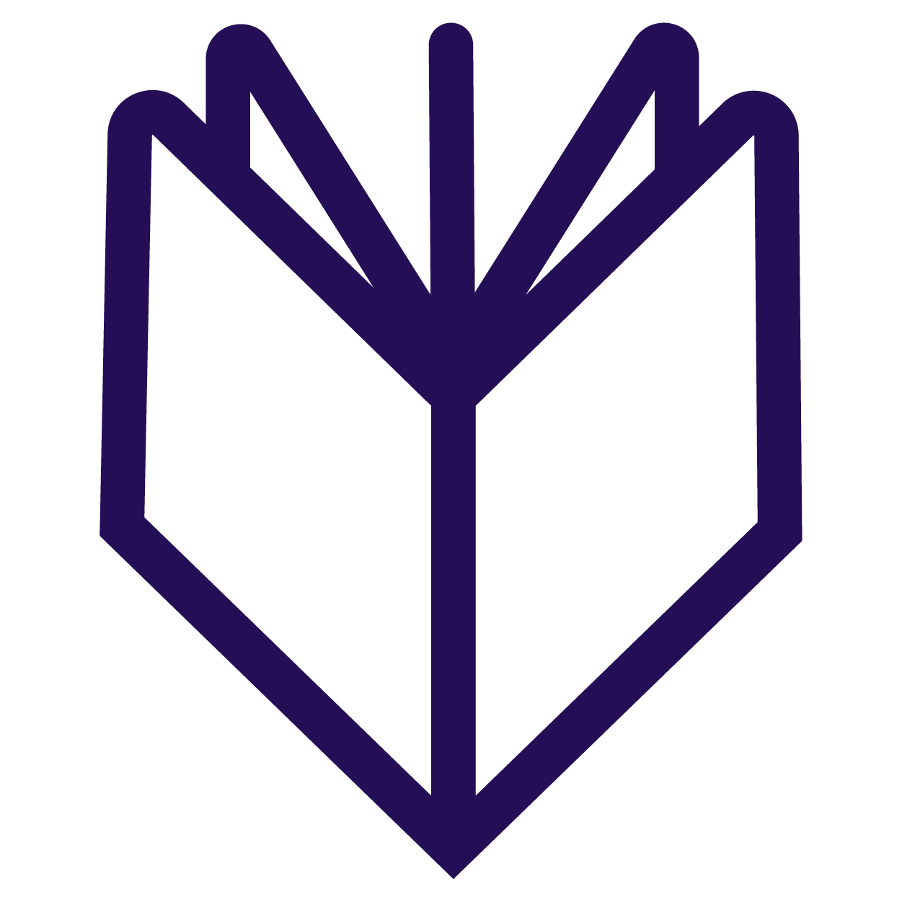
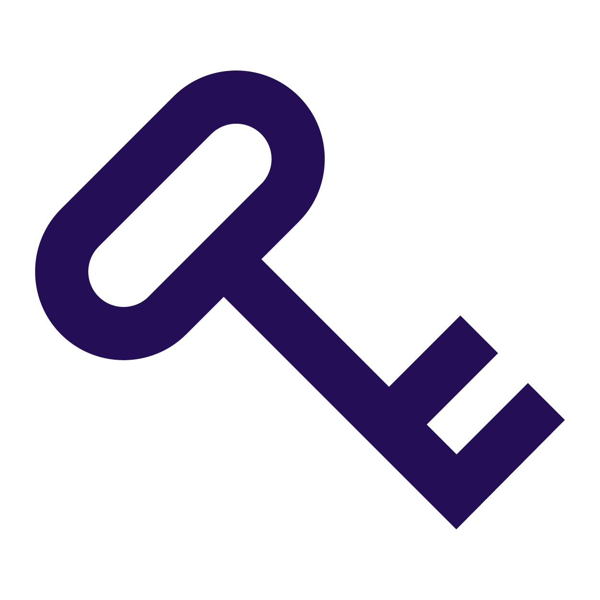
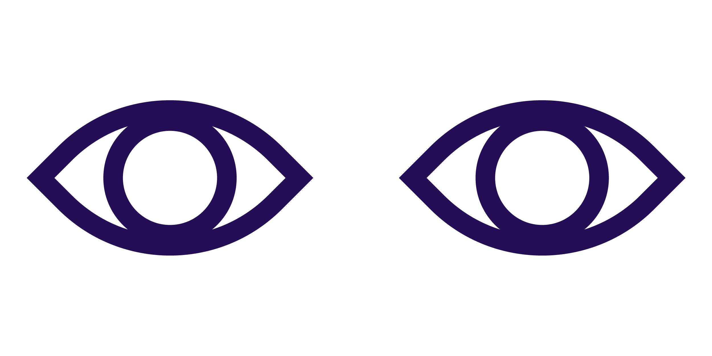
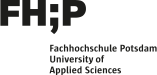
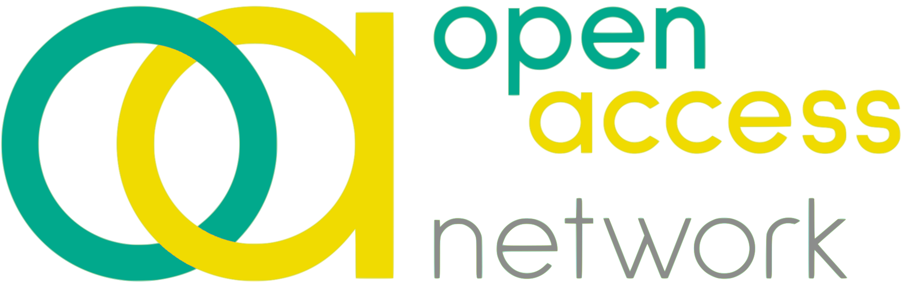
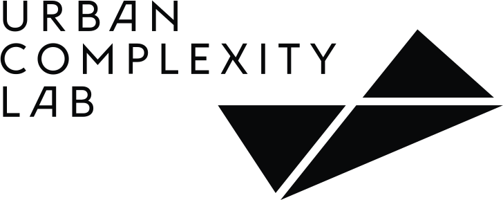

<section class="outer-introduction">
  

  

    <h2 class="initial-quote">
      What if the results from publicly funded research were freely available to everyone?
    </h2>
    
  
        Open Access represents this vision of unrestricted access and use of scholarly publications and further research materials freely available worldwide without any legal, technical or financial barriers. 
        Germany supports this idea at both the federal and state levels. Numerous research and higher education institutions have already issued open access policies and guidelines. Together with their libraries, they engage in open access advocacy activities and offer consultancy on issues related to open access to students and researchers. They build open access repositories and manage publication funds to cover open access publication costs. The project open-access.network collects data on individual institutions at federal state level as well as strategic political activities to showcase best practices and provide an overview of the open access activities.
    

    

      

        <em>
          Please note: The summer school will be given in English. It is targeted at advanced students enrolled in design, information science, or computer science at Fachhochschule Potsdam, Freie Universität Berlin and Humboldt-Universität zu Berlin. Students and researchers from other institutions are encouraged to apply as well. Your participation benefits from basic knowledge of data structures and algorithms. The number of participants is limited to 25.
        </em>
      
  
  

  

  

    

      The summer school will focus on visualizing open access in Germany (<a href="https://doi.org/10.5281/zenodo.4644125">Open Access Bundesländer-Atlas</a>) and beyond to raise awareness of this transformation in academic publishing. This summer school aims at providing participants with an introduction to principles and methods of information visualization combined with an opportunity to apply general principles to specific visualization designs to exemplary use cases such as Open Access Bundesländer-Atlas. Lectures with experts from the fields of human-computer interaction, information science, and interface design from the cooperating institutions cover the topics of the fundamentals of information visualization e.g. mapping data to visual variables, and techniques for visualizing multidimensional, relational and textual data as well as an introduction to the concept of open access. Particicipants will closely collaborate in small, interdisciplinary teams. The hands-on session tutorials complement the inputs during the lectures with practical activities and assignments directed towards a visual representation of the data. The summer school is a cooperation between Fachhochschule Potsdam, Humboldt-Universität zu Berlin, Freie Universität Berlin and the Open-Access-Büro Berlin acting on behalf of the BMBF funded project <a href="https://open-access.net/ueber-uns/oa-network">open-access.network</a>. Furthermore, the Vernetzungs- und Kompetenzstelle zu Open Access in Brandenburg will also be involved in the summer school.
    

  

  

    

      <a href="#description" class="btn btn-inactive">Access keynotes</a>
       
      <a href="#schedule">See full schedule &#10132;</a>
       
    

  

  

</section>
<section class="outer-schedule">
  

    
    <h1>Schedule</h1>
    
Preliminary workshops and keynotes, full schedule to be released upon registration.

    

      <h2>Week One</h2>
      

        

          <table>
            <tr>
              <th colspan="2">Monday, 6 September 2021</th> 
            </tr>
            <tr>
              <td>09:00</td>
              <td>Registration</td>
            </tr>
            <tr>
              <td>09:30</td>
              <td>Welcome, introduction</td>
            </tr>
            <tr>
              <td>10:00</td>
              <td>Open Access: Theory and basics</td>
            </tr>
            <tr>
              <td>11:00</td>
              <td>Open Access and Open research in Berlin</td>
            </tr>
            <tr>
              <td>12:00</td>
              <td>Data Visualization Basics</td>
            </tr>
            <tr>
              <td>12:30</td>
              <td>Lunch</td>
            </tr>
            <tr>
              <td>14:00</td>
              <td>
                Introduction to data - Bundesländer-Atlas OA
              </td>
            </tr>
            <tr>
              <td>15:00</td>
              <td>
                Team building
              </td>
            </tr>
            <tr>
              <td>16:30</td>
              <td>
                Keynote by <a href="http://www.johannadrucker.net/">
                  Johanna Drucker</a>: Modeling Chronology and Temporality
              </td>
            </tr>
            <tr>
              <td>18:00</td>
              <td>
                Wrap-up
              </td>
            </tr>
          </table>
        

        

          <table>
            <tr>
              <th colspan="2">Tuesday, 7 September 2021</th> 
            </tr>
            <tr>
              <td>09:00</td>
              <td>Check-in</td>
            </tr>
            <tr>
              <td>09:30</td>
              <td>Lecture: How to run a datavis project</td>
            </tr>
            <tr>
              <td>10:30</td>
              <td>Workshop: Reflecting on datavis case studies</td>
            </tr>
            <tr>
              <td>12:00</td>
              <td>Lunch</td>
            </tr>
            <tr>
              <td>13:30</td>
              <td>
                Project work
              </td>
            </tr>
            <tr>
              <td>16:00</td>
              <td>First mentoring meeting</td>
            </tr>
            <tr>
              <td>17:30</td>
              <td>
                Wrap-up
              </td>
            </tr>
          </table>
        

        

          <table>
            <tr>
              <th colspan="2">Wednesday, 8 September 2021</th> 
            </tr>
            <tr>
              <td>09:00</td>
              <td>Check-in</td>
            </tr>
            <tr>
              <td>09:30</td>
              <td>Lecture: Designerly visualization research and methods</td>
            </tr>
            <tr>
              <td>12:00</td>
              <td>Lunch</td>
            </tr>
            <tr>
              <td>13:30</td>
              <td>
                Tutorial: Visualization tools
              </td>
            </tr>
            <tr>
              <td>15:30</td>
              <td>Project work</td>
            </tr>
            <tr>
              <td>17:30</td>
              <td>
                Wrap-up
              </td>
            </tr>
          </table>
        

        

          <table>
          <tr>
            <th colspan="2">Thursday, 9 September 2021</th> 
          </tr>
          <tr>
            <td>09:00</td>
            <td>Check-in</td>
          </tr>
          <tr>
            <td>09:30</td>
            <td>Lecture: Visualization of open cultural heritage data</td>
          </tr>
          <tr>
            <td>10:15</td>
              <td>
                Workshop: Visualization coding
              </td>
          </tr>
          <tr>
            <td>12:00</td>
            <td>Lunch</td>
          </tr>
          <tr>
            <td>13:30</td>
            <td>Workshop: Visualization coding II</td>
          </tr>
          <tr>
            <td>15:00</td>
            <td>Project work</td>
          </tr>
          <tr>
              <td>17:30</td>
              <td>
                Wrap-up
              </td>
           </tr>
            <tr>
              <td>18:00</td>
              <td>
                Dinner in Potsdam (optional)
              </td>
           </tr>
        </table>
        

        

          <table>
          <tr>
            <th colspan="2">Friday, 10 September 2021</th> 
          </tr>
          <tr>
            <td>09:00</td>
            <td>Check-in</td>
          </tr>
          <tr>
            <td>09:30</td>
            <td>Project work</td>
          </tr>
          <tr>
            <td>12:00</td>
            <td>Lunch</td>
          </tr>
          <tr>
            <td>13:30</td>
            <td>Interim presentations</td>
          </tr>
          <tr>
            <td>16:00</td>
            <td>Keynote by <a href="https://www.weizenbaum-institut.de/portrait/p/sonja-schimmler/">Sonja Schimmler</a>:
						Research Knowledge Graphs and their Visualization</td>
          </tr>
          <tr>
            <td>17:30</td>
            <td>Wrap-up</td>
          </tr>
        </table>
        

      

      

      <h2>Week Two</h2>
      

      

        <table>
          <tr>
            <th colspan="2">Monday, 13 September 2021</th> 
          </tr>
          <tr>
            <td>09:00</td>
            <td>Check-in</td>
          </tr>
          <tr>
            <td>09:30</td>
            <td>Analyzing open data sources for Open Access using R</td>
          </tr>
          <tr>
            <td>12:00</td>
            <td>Lunch</td>
          </tr>
          <tr>
            <td>13:30</td>
            <td>
              Project work
            </td>
          </tr>
          <tr>
            <td>17:00</td>
            <td>
              Wrap-up
            </td>
          </tr>
        </table>
      

      

        <table>
          <tr>
            <th colspan="2">Tuesday, 14 September 2021 Theory day</th> 
          </tr>
          <tr>
            <td>09:00</td>
            <td>Check-in</td>
          </tr>
          <tr>
            <td>09:30</td>
            <td>Lecture: Visualization as an epistemic tool</td>
          </tr>
          <tr>
            <td>10:15</td>
            <td>Reading group</td>
          </tr>
          <tr>
            <td>12:00</td>
            <td>Lunch</td>
          </tr>
          <tr>
            <td>13:30</td>
            <td>
              Project work 
            </td>
          </tr>
          <tr>
            <td>16:00</td>
            <td>
              Second mentoring meeting 
            </td>
          </tr>
          <tr>
            <td>17:30</td>
            <td>
              Wrap-up
            </td>
          </tr>
        </table>
      

      

        <table>
          <tr>
            <th colspan="2">Wednesday, 15 September 2021</th> 
          </tr>
          <tr>
            <td>09:00</td>
            <td>Check-in</td>
          </tr>
          <tr>
            <td>09:30</td>
            <td>Project Work</td>
          </tr>
          <tr>
            <td>12:00</td>
            <td>Lunch</td>
          </tr>
          <tr>
            <td>13:30</td>
            <td>
              Project work
            </td>
          </tr>
          <tr>
            <td>15:30</td>
            <td>Project screening and collective critique</td>
          </tr>
          <tr>
            <td>17:00</td>
            <td>Wrap-up</td>
          </tr>
        </table>
      

      

        <table>
        <tr>
          <th colspan="2">Thursday, 16 September 2021</th> 
        </tr>
        <tr>
          <td>09:00</td>
          <td>Check-in</td>
        </tr>
        <tr>
          <td>09:30</td>
          <td>Lecture: Data Feminism</td>
        </tr>
        <tr>
          <td>10:15</td>
          <td>Reading group</td>
        </tr>
        <tr>
          <td>12:00</td>
          <td>Lunch</td>
        </tr>
        <tr>
          <td>13:30</td>
          <td>Project work</td>
        </tr>
        <tr>
          <td>15:00</td>
          <td>Project work</td>
        </tr>
        <tr>
          <td>17:00</td>
          <td>Wrap-up</td>
        </tr>
        <tr>
          <td>18:00</td>
          <td>Dinner in Berlin (optional)</td>
        </tr>
      </table>
      

      

        <table>
        <tr>
          <th colspan="2">Friday, 17 September 2021</th> 
        </tr>
        <tr>
          <td>09:00</td>
          <td>Check-in</td>
        </tr>
        <tr>
          <td>09:30</td>
          <td>Project work</td>
        </tr>
        <tr>
          <td>10:30</td>
            <td>
             Project Presentations I
            </td>
        </tr>
        <tr>
          <td>12:00</td>
          <td>Lunch</td>
        </tr>
        <tr>
          <td>13:30</td>
          <td>Project Presentations II</td>
        </tr>
        <tr>
          <td>15:00</td>
          <td>Jury sets scores</td>
        </tr>
        <tr>
          <td>15:30</td>
          <td>Mentoring Debrief and Advice</td>
        </tr>
        <tr>
          <td>16:30</td>
          <td>Feedback</td>
        </tr>
        <tr>
          <td>17:30</td>
          <td>Wrap-up</td>
        </tr>
      </table>
      

      

    

    

    

</section>
<section class="description-outer" id="description">
  

    
    <h1>Application</h1>
    

      

        Submissions are closed.
      

    

    

      

        Interested participants should submit a short (max. 1 page) motivational statement and a short CV (max. 2 pages). In this statement you should list prior experiences, interests or knowledge that is relevant to the topic of the summer school. This could include, but is not limited to, expertise in areas that relate to aspects of Open Access and Open Science, attended courses e.g. in information science, experience in design, or other skills such as coding. Your application should clearly convey your interest in the topics of the summer school (Open Access, Open Science, Visualization). Don’t hesitate to apply even without any prior experience or skills in the above mentioned areas - as long as you can convey your interest and motivation you will be considered for participation!
        The 25 participants of the Summer School will be preferably equally chosen fr om the participating institutions (Fachhochschule Potsdam, Humboldt-Universität zu Berlin, Freie Universität Berlin) and we will aim for a balanced and diverse group of participants.
      

      

      
  
        
          The deadline for your submission was 15 July 2021, submissions are now closed.
         
        To <b>access keynotes</b>, please send a note to the following address: 
        <a href="mailto:oabb@open-access-berlin.de?subject=OA Summer School Keynotes: request for access">
          oabb@open-access-berlin.de</a>. 
        

      

    

    

      <a href="mailto:oabb@open-access-berlin.de?subject=OA Summer School Keynotes: request for access" class="btn">
        Request guest access to keynotes
      </a>
    

    

      

        <table>
          <tr>
            <td>Dates</td>
            <td>6-17 September 2021, Mondays-Fridays at 9am–6pm</td>       
          </tr>
          <tr>
            <td>Place</td>
            <td>online via Zoom</td>
          </tr>
          <tr>
            <td>Levels</td>
            <td>BA, MA, PhD</td>  
          </tr>
          <tr>
            <td>Credits</td>
            <td>5 ECTS for students at Fachhochschule Potsdam (Design and Information Sciences) and at Humboldt-Universität zu Berlin (IBI)</td>
          </tr>
          <tr>
            <td>Contact</td>
            <td><a href="mailto:oabb@open-access-berlin.de?subject=OA Summer School Contact">
          oabb@open-access-berlin.de</a></td>
          </tr>
        </table>
      

    

  

</section>
<section class="about-outer-container">
  

    
    <h1>About</h1>
      

          

            The summer school is a cooperation between Fachhochschule Potsdam, Humboldt-Universität zu Berlin, Freie Universität Berlin and the Open-Access-Büro Berlin acting on behalf of the BMBF funded project <a href="https://open-access.net/ueber-uns/oa-network">open-access.network</a>. Furthermore, the Vernetzungs- und Kompetenzstelle zu Open Access in Brandenburg will also be involved in the summer school.
          

      

      

        

          <h5>Team</h5>
          <ul>
            <li>Sara Akhlaq  
UCLAB, University of Applied Sciences Potsdam
</li>
            <li>Marian Dörk  
UCLAB, University of Applied Sciences Potsdam
</li>
            <li>Linda Freyberg  
UCLAB, University of Applied Sciences Potsdam / Museum für Naturkunde Berlin
</li>
            <li>Katrin Glinka  
Human-Centered Computing (HCC) Research Group, Freie Universität Berlin
</li>
            <li>Ben Kaden  
Kompetenz- und Vernetzungsstelle zu Open Access in Brandenburg /  Berlin School of Library and Information Science, Humboldt-Universität zu Berlin
</li>
            <li>Tobias Kauer  
UCLAB, University of Applied Sciences Potsdam / University of Edinburgh
</li>
            <li>Maxi Kindling  
Open-Access-Büro Berlin, Freie Universität Berlin / Berlin School of Library and Information Science, Humboldt-Universität
</li>
            <li>Francesca Morini  
UCLAB, University of Applied Sciences Potsdam
</li>
            <li>Claudia Müller-Birn  
Human-Centered Computing (HCC) Research Group, Freie Universität Berlin
</li>
            <li>Maike Neufend  
Open-Access-Büro Berlin, Freie Universität Berlin
</li>
            <li>Vivien Petras  
Berlin School of Library and Information Science, Humboldt-Universität zu Berlin
</li>
            <li>Arran Ridley  
UCLAB, University of Applied Sciences Potsdam
</li>
            <li>Hannah Schwan  
UCLAB, University of Applied Sciences Potsdam
</li>
            <li>Dorothea Strecker  
Berlin School of Library and Information Science, Humboldt-Universität zu Berlin
 </li>
            <li>Agnieszka Wenninger  
Open-Access-Büro Berlin, Freie Universität Berlin
</li>
          </ul>
        

        

          <!-- 

          <h5>Stay updated</h5>
            
<a href="https://twitter.com/search?q=%23voass&src=typed_query">#voass &#10132;</a>

          
 -->
          

            <h5>Affiliations</h5>
            

              
              
              
              
							
              
              

          

        

    

  

</section>
